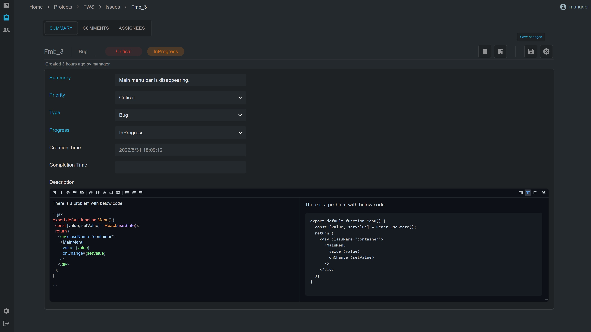
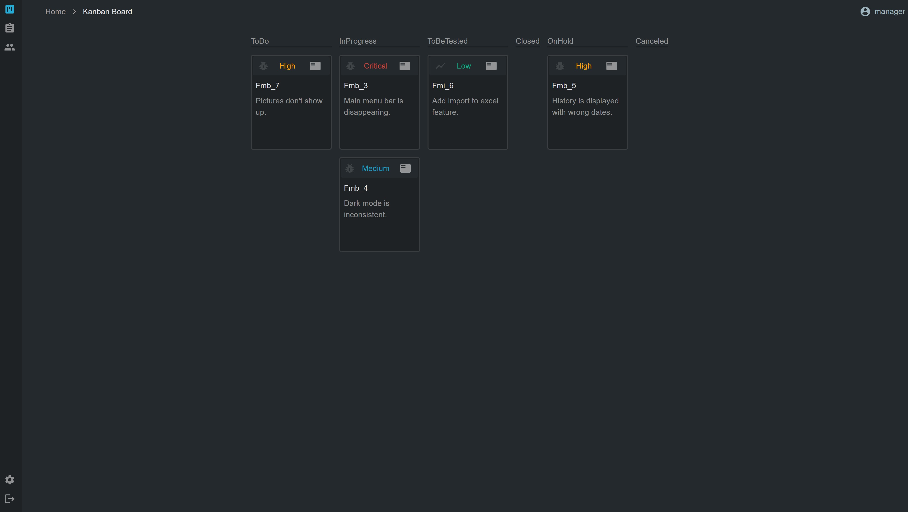

Issue Tracker
------------





## Tech Stack
|   |  |   |   |   | 
|---|---|---|---|---|
|  Frontend | <div align="center"></br>React</div> | <div align="center"></br>TypeScript</div>  |  <div align="center"></br>Material UI</div> | <div align="center"></br>Auth0</div>  |
| Backend  | <div align="center"></br>.NET</div>| <div align="center"></br>C#</div> | <div align="center"></br>EF Core</div>  | <div align="center"></br>xUnit</div>  |

### Cloning the repo
```sh
https://github.com/dotNetGaijin87/IssueTracker-private.git
```
