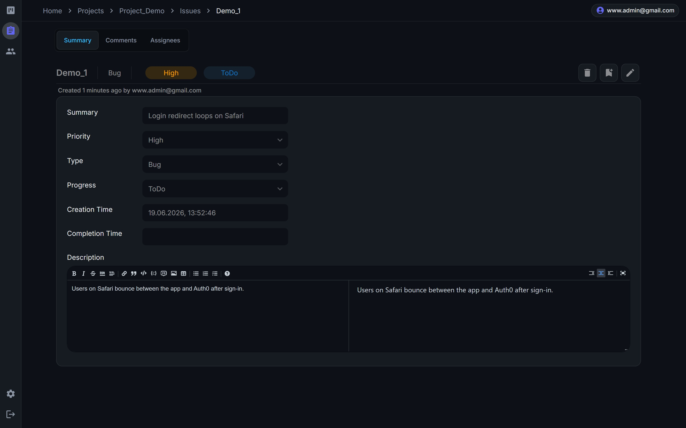
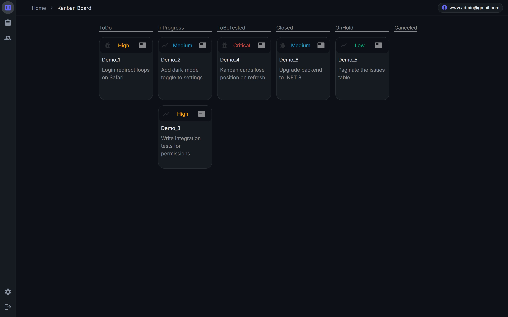
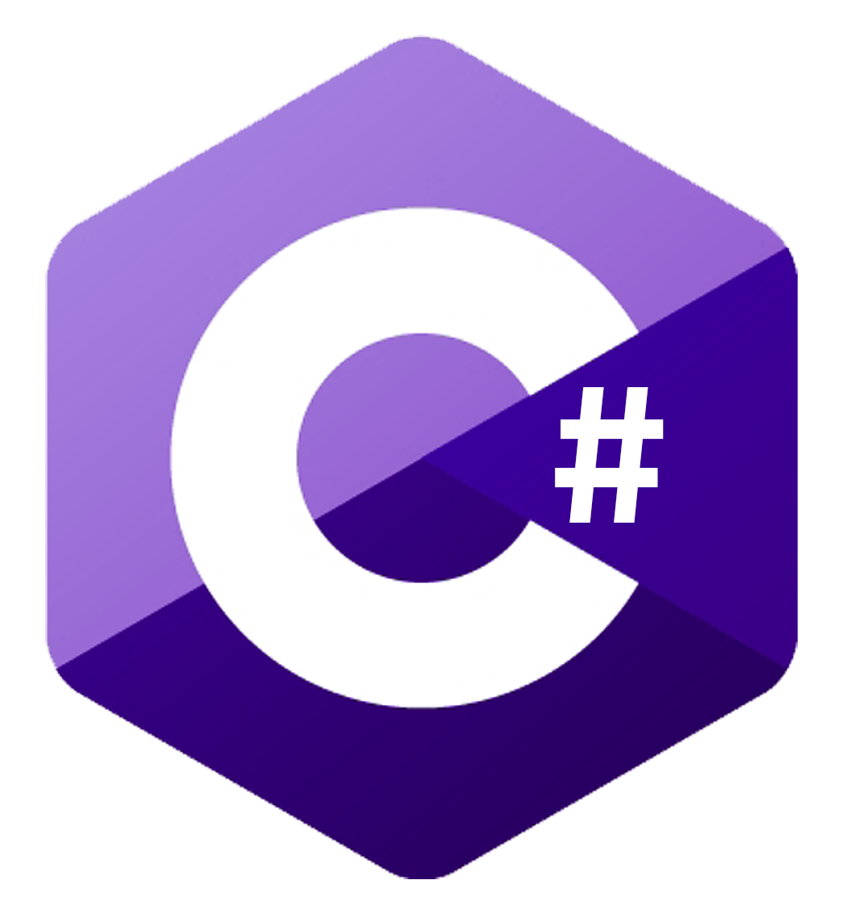

# Issue Tracker

A full-stack issue & project management app (think a lightweight Jira) with a drag-and-drop Kanban board, role-based permissions, and a Clean Architecture .NET backend.

[](https://github.com/dotNetGaijin87/IssueTracker/actions/workflows/ci.yml)


[](./LICENSE.md)





## Overview

Issue Tracker lets teams organise work into **projects**, break projects down into **issues**, collaborate through **comments**, and manage who can do what via **per-issue permissions**. Issues move through their workflow on a drag-and-drop **Kanban board**, and authentication/authorization is handled by **Auth0**.

The project's main purpose is to demonstrate a production-shaped codebase: a layered **Clean Architecture** backend using the **CQRS** pattern, a typed **React + TypeScript** frontend, and a test suite covering unit and integration levels.

## Features

- **Projects, issues & comments** — full CRUD with server-side validation
- **Kanban board** — drag issues between workflow columns; positions persist
- **Auth0 authentication** + role/permission-based authorization
- **Modern dark UI** — Material UI with a custom indigo theme, applied consistently across every page
- **Filtering, sorting & pagination** on list views
- **i18n-ready** UI (react-i18next)
- **Markdown** issue descriptions and comments
- **Health-check** endpoint for container orchestration

## Architecture

The backend follows **Clean Architecture**, splitting the solution into four projects with dependencies pointing inward toward the domain:

```
┌───────────────────────────────────────────────────────────┐
│  IssueTracker (Web API)   controllers, DI wiring, auth      │
│  ┌─────────────────────────────────────────────────────┐  │
│  │  Application   CQRS commands/queries, validation,     │  │
│  │                MediatR pipeline behaviours, mapping   │  │
│  │  ┌───────────────────────────────────────────────┐  │  │
│  │  │  Domain   entities & enums (no dependencies)    │  │  │
│  │  └───────────────────────────────────────────────┘  │  │
│  └─────────────────────────────────────────────────────┘  │
│  Infrastructure   EF Core DbContext, persistence, services  │
└───────────────────────────────────────────────────────────┘
```

Every request flows through a **MediatR** pipeline of cross-cutting behaviours before it reaches its handler:

```
HTTP request → Controller → MediatR → [ Authorization → Validation → Performance ] → Handler → EF Core
```

- **Authorization behaviour** — checks the caller's role/permissions against attributes on the request
- **Validation behaviour** — runs FluentValidation validators and short-circuits on failure
- **Performance behaviour** — logs slow requests (>1s)

## Tech Stack

|          |                                                                                                     |                                                                                                    |                                                                                                      |                                                                                                   |
| -------- | --------------------------------------------------------------------------------------------------- | -------------------------------------------------------------------------------------------------- | ---------------------------------------------------------------------------------------------------- | ------------------------------------------------------------------------------------------------- |
| Frontend | <div align="center"></br>React 18</div> | <div align="center"></br>TypeScript</div> | <div align="center"></br>Material UI</div> | <div align="center"></br>Auth0</div> |
| Backend  | <div align="center"></br>.NET 8</div>  | <div align="center"></br>C#</div>     | <div align="center"></br>EF Core</div>      | <div align="center"></br>xUnit</div>      |

**Also using:** MediatR (CQRS), FluentValidation, AutoMapper, Vite, react-hook-form, Docker, SQL Server.

## Getting started

### Prerequisites

- [.NET 8 SDK](https://dotnet.microsoft.com/download)
- [Node.js 18+](https://nodejs.org/)
- SQL Server 2019+ (or SQL Server Express / LocalDB)

### Backend

Create your local settings from the template and point the connection string at your
SQL Server (environment-specific settings are git-ignored, never committed):

```bash
cd server/src/IssueTracker
cp appsettings.Development.json.example appsettings.Development.json
# edit the ConnectionStrings, then:
dotnet run
```

The connection string can also be supplied via an environment variable
(`ConnectionStrings__DefaultConnection`) or [user secrets](https://learn.microsoft.com/aspnet/core/security/app-secrets),
which is preferred for anything sensitive.

### Frontend

```bash
cd client
cp .env.example .env   # API URL + Auth0 settings (see .env.example)
npm install
npm run dev
```

The app starts on http://localhost:3000 and talks to the backend API.

### Demo login

Sign in with the demo account — it lands on a pre-populated Kanban board:

> Email: www.admin@gmail.com </br>
> Password: Admin12#$

> _Note:_ this is a throwaway demo account on a development Auth0 tenant, kept here so
> reviewers can try the app. No application secrets are committed to the repo — the
> backend validates Auth0 JWTs using only the public authority/audience, and the
> frontend uses public SPA values.

### Run the whole stack with Docker Compose

The fastest way to try the app — no .NET SDK, Node, or SQL Server install required, just Docker:

```bash
docker compose up --build
```

This starts three containers — SQL Server, the API, and the nginx-served frontend —
and **automatically creates and seeds the database** with demo data on startup. Then open:

- Frontend: http://localhost:3000
- API: http://localhost:7000 (health check at `/api/healthstatus`)

Stop and remove everything with `docker compose down` (add `-v` to also drop the database volume).

> **Behind a corporate proxy?** If the image build fails with TLS / certificate errors during
> `dotnet restore` or `npm install` (e.g. NuGet `NU1301`), your network is intercepting TLS and the
> build containers don't trust its root CA. Build on a normal network, or add the proxy's CA to the
> build images.

## Tests

Unit tests run without any external dependencies:

```bash
dotnet test server/tests/UnitTests/IssueTracker.ApplicationTests
dotnet test server/tests/UnitTests/IssueTracker.InfrastructureTests
```

Integration tests spin up the API in-memory via `WebApplicationFactory` and require a SQL Server instance:

```bash
dotnet test server/tests/IntegrationTests/IssueTracker.IntegrationTests
```

The backend build + unit tests and the frontend build run automatically on every push via [GitHub Actions](./.github/workflows/ci.yml).

## License

[MIT](./LICENSE.md)
